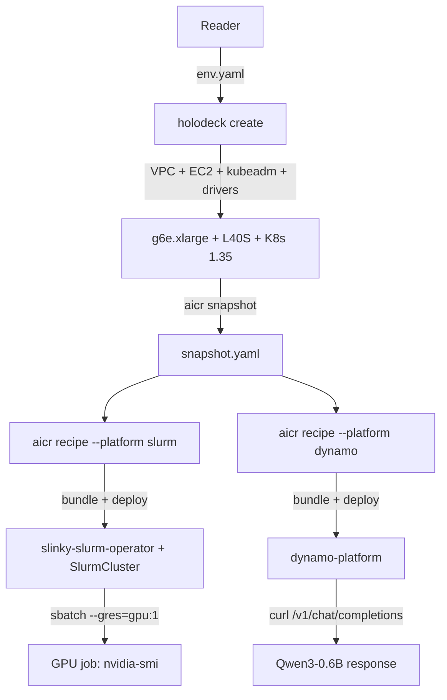

# Holodeck + AICR: From Zero to a Multi-Platform GPU Cluster

> Provision a GPU-ready Kubernetes cluster with Holodeck, then layer
> Slurm (HPC) and Dynamo (inference) on top with AICR — end-to-end in
> ~25 minutes for about $2 of AWS spend.

## What you'll build

End state: one AWS `g6e.xlarge` instance (1× NVIDIA L40S), a single-
node kubeadm cluster, the `slinky-slurm-operator` running a one-node
Slurm cluster (you can `sbatch --gres=gpu:1`), and the Dynamo platform
serving Qwen3-0.6B over an OpenAI-compatible API.

The "superpower" is composition: one declarative `Environment`, one
snapshot, two validated recipes — both an HPC batch path and an
inference path running on the same hardware.

## Prerequisites

- `holodeck` v0.3.0+ installed (`make build && sudo mv ./bin/holodeck /usr/local/bin/`)
- `aicr` v0.x installed (`brew install NVIDIA/aicr/aicr` — see
  [AICR installation](https://github.com/NVIDIA/aicr/blob/main/docs/user/installation.md))
- AWS account with credentials in your environment and `g6e` quota in
  `us-west-2` (request via the EC2 service quotas console)
- `kubectl`, `yq`, `jq`, and `curl` on your path
- ~$2 of AWS spend budget (g6e.xlarge is roughly $1.86/hr on-demand
  in `us-west-2`)

## Phase 1 — Provision with Holodeck

<!-- Filled in Task 4 -->

## Phase 2 — Compose with AICR

<!-- Filled in Tasks 5–8 -->

## Why this matters

<!-- Filled in Task 9 -->

## Troubleshooting

<!-- Filled in Task 9 -->

## Next steps + cleanup

<!-- Filled in Task 9 -->
