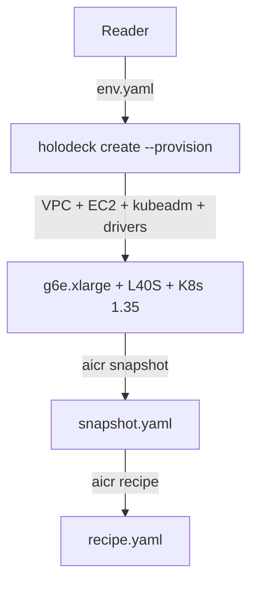

# Holodeck + AICR: Provisioning and Cluster Snapshot (Preview)

> **Status: preview.** This guide currently covers the Day-0 half of
> the holodeck → AICR flow: provisioning a GPU cluster with Holodeck,
> then capturing a snapshot and generating a recipe with AICR. The
> end-to-end Slurm and Dynamo deploy paths require upstream changes
> that are still in flight (see [What's coming](#whats-coming)).

## What you'll build

A single-node AWS `g6e.xlarge` instance (1× NVIDIA L40S), a kubeadm
Kubernetes cluster on top of it, an AICR snapshot describing that
cluster, and an AICR recipe matched to the snapshot — all in ~20
minutes for about $2 of AWS spend.



The reduced v1 stops at recipe generation. The bundle/deploy/validate
finale ships once the upstream catalog and platform gaps close.

## Prerequisites

- `holodeck` v0.2.18+ installed (`make build && sudo mv ./bin/holodeck /usr/local/bin/`)
- `aicr` v0.12.0+ installed (`brew install NVIDIA/aicr/aicr` — see
  [AICR installation](https://github.com/NVIDIA/aicr/blob/main/docs/user/installation.md))
- AWS account with credentials in your environment and `g6e` quota in
  `us-west-2` (request via the EC2 service quotas console)
- `kubectl`, `yq`, and `jq` on your path
- ~$2 of AWS spend budget (g6e.xlarge is roughly $1.86/hr on-demand
  in `us-west-2`)

## Phase 1 — Provision with Holodeck

### 1.1 Configure

Open [`examples/aicr-demo/environment.yaml`](../../examples/aicr-demo/environment.yaml):

```yaml
apiVersion: holodeck.nvidia.com/v1alpha1
kind: Environment
metadata:
  name: aicr-demo-l40s
spec:
  provider: aws
  auth:
    keyName: <your key name here>
    privateKey: <your key path here>
  instance:
    type: g6e.xlarge          # 1x NVIDIA L40S (48 GiB VRAM), 4 vCPU, 32 GiB host RAM
    region: us-west-2
    os: ubuntu-22.04
    image: { architecture: x86_64 }
  containerRuntime:    { install: true, name: containerd }
  nvidiaContainerToolkit: { install: true }
  nvidiaDriver:        { install: true }
  kubernetes:
    install: true
    installer: kubeadm
    version: v1.35.0
    crictlVersion: v1.35.0
```

What matters in this YAML:

- `provider: aws` + `auth` (`keyName`, `privateKey`) — the only fields you edit.
- `instance.type: g6e.xlarge` — cheapest cloud SKU with an L40S.
- `os: ubuntu-22.04` — AMI auto-resolved by region; SSH user auto-detected.
- `kubernetes.version: v1.35.0` — the current line; pair with a matching
  `crictlVersion`.
- `containerd` + `nvidiaDriver` + `nvidiaContainerToolkit` — Day 0
  ends at host-level GPU access. Kubernetes-level GPU resources land
  in Phase 2 once AICR installs the GPU Operator.

Copy the example into your working directory and fill in your AWS key:

```bash
cp examples/aicr-demo/environment.yaml ./my-env.yaml
$EDITOR ./my-env.yaml  # set auth.keyName and auth.privateKey
```

### 1.2 Create the cluster

```bash
holodeck create -f ./my-env.yaml --provision
```

The `--provision` flag is required: without it, `holodeck create` only
spins up the EC2 instance and stops there. With it, holodeck creates
a VPC, a security group, an EC2 instance, then runs the Ansible plays
that install driver, container runtime, toolkit, and kubeadm. Total
wall-clock is typically 6–8 minutes for create + provision; longer if
your AWS account is provisioning a fresh AMI.

Monitor progress:

```bash
holodeck list
holodeck status <instance-id>
```

For a pre-flight check that does not touch AWS:

```bash
holodeck dryrun -f ./my-env.yaml
```

On success, holodeck records the instance with `PROVISIONED: true`.
Note the instance ID (an 8-char hex string) printed at the end.

### 1.3 Fetch the kubeconfig

```bash
holodeck get kubeconfig -o ./kubeconfig <instance-id>
```

Two things to know about the kubeconfig:

- The flag-then-positional order matters: `-o ./kubeconfig` must
  come before the instance ID. The reverse order is rejected with
  "instance ID is required".
- The server URL points at the instance's public DNS name (the
  apiserver cert SAN now includes it). `kubectl` from your laptop
  works without `--insecure-skip-tls-verify`.

### 1.4 Verify the cluster

Point `kubectl` at the new cluster and confirm the node is Ready:

```bash
export KUBECONFIG=$PWD/kubeconfig
kubectl get nodes -o wide
```

You should see a single node (control-plane and worker on the same
host) running `v1.35.0`.

> Note on GPU verification at Day 0: the `nvidia` `RuntimeClass` is
> not installed by holodeck. A Day-0 `runtimeClassName: nvidia` pod
> will fail with "RuntimeClass nvidia not found". Kubernetes-level
> GPU access — both the runtime class and the `nvidia.com/gpu`
> resource — is the GPU Operator's job, installed by AICR in Phase 2.

## Phase 2 — Capture with AICR

### 2.1 Snapshot the cluster

```bash
aicr snapshot --output snapshot.yaml
```

A snapshot is AICR's read of your live cluster — node provider, GPU
model, kernel, container runtime, OS, K8s server version, installed
operators. It is the input AICR uses to derive a matching recipe.

Skim a few key fields:

```bash
yq '.measurements[] | select(.type=="GPU") | .subtypes[] | .data.gpu.model // .data.gpu.product-architecture' snapshot.yaml
yq '.measurements[] | select(.type=="Kubernetes") | .subtypes[0].data.server_version' snapshot.yaml
```

You should see `NVIDIA L40S` with architecture `Ada Lovelace`, and
`v1.35.0` for Kubernetes. Snapshot capture takes under a minute and
runs as a Job in your cluster's `default` namespace (the agent pod is
cleaned up after the snapshot is collected).

### 2.2 Generate a recipe

```bash
aicr recipe --snapshot snapshot.yaml \
  --intent inference --platform dynamo \
  --output recipe.yaml
```

AICR matches the snapshot against its overlay catalog and emits a
recipe describing the components it would install for the requested
intent + platform. Inspect the resulting component list:

```bash
yq '.componentRefs[].name' recipe.yaml
```

On L40S today, you should see ten components in the recipe:
`cert-manager`, `gpu-operator`, `k8s-ephemeral-storage-metrics`,
`kai-scheduler`, `kube-prometheus-stack`, `nfd`, `nodewright-operator`,
`nvidia-dra-driver-gpu`, `nvsentinel`, `prometheus-adapter`. This is
the `base` overlay plus `monitoring-hpa`.

> Note: AICR's overlay catalog currently has rich coverage for H100,
> GB200, and B200 hardware, with L40S coverage still in flight. On
> L40S today the recipe is the base set — the `dynamo-platform`
> component is not yet matched. See [What's coming](#whats-coming).

The snapshot → recipe step demonstrates the matching mechanic that
makes AICR reproducible: given the same snapshot, you get the same
recipe, and that recipe is what `aicr bundle` would turn into a
deployable Helm chart sequence in the full demo.

## What's coming

The full end-to-end demo (Slurm batch job + Dynamo chat-completions
finale) is gated on three upstream changes:

- **AICR PR #866 (Slinky/Slurm)** — adds `--platform slurm`. Currently
  on the feature branch `feat/slinky-slurm-operator`, not yet merged
  to `main`. Enables the Phase 2 Slurm track.
- **AICR overlay catalog — L40 coverage** — `--accelerator l40` today
  matches only the `base` + `monitoring-hpa` overlays, so the inference
  recipe does not include `dynamo-platform`. Tracked upstream.
- **GPU Operator on kubeadm + holodeck driver** — the `gdrcopy-validation`
  init container of `nvidia-operator-validator` requires the `gdrdrv`
  kernel module, which is not installed by holodeck's Ansible plays.
  Until either side closes that gap, the bundle deploy stalls on the
  GPU Operator step.

When these land, the doc grows back the bundle/deploy/validate sections
and the Slurm + Dynamo tracks of the original design.

## Troubleshooting

**`g6e` quota denied.** New AWS accounts often don't have GPU quota in
`us-west-2`. Request it via the Service Quotas console: search for
"Running On-Demand G and VT instances" → request 4 vCPUs minimum.

**`holodeck create` hangs on the Ansible play.** The driver install
step can take 4–6 minutes. Tail the holodeck process; if it's still
making SSH calls, wait. If it errors with "kernel headers not found",
re-check `os: ubuntu-22.04` matches a current Ubuntu version with
stable NVIDIA driver kernel-module packaging.

**`holodeck update <id> --reprovision` says "instance ID is required".**
The flag must precede the positional ID:
`holodeck update --reprovision <id>`. The CLI parser does not accept
the reverse order despite what the `--help` examples show. Same
ordering applies to `holodeck get kubeconfig -o <path> <id>`.

**Security group is `0.0.0.0/0` instead of your public IP.** Holodeck
falls back to `0.0.0.0/0` when it cannot detect your public IP. Either
edit the security group post-create in the EC2 console, or run
`holodeck create` from a network that exposes a routable IP.

**`aicr snapshot` fails to read kernel config.** The agent emits a
non-fatal `failed to read kconfig` warning on holodeck-provisioned
nodes that don't ship `/proc/config.gz` or kernel headers. The
snapshot still completes; the missing kconfig data only matters for
recipes that constrain on specific kernel features.

## Next steps + cleanup

Tear down when you're done:

```bash
holodeck delete <instance-id>
```

The teardown also removes the security group, subnet, route table,
internet gateway, and VPC that holodeck created.

Where to go next:

- [Multi-node clusters](multinode-clusters.md) — scale beyond
  single-node for real Slurm and inference workloads.
- AICR variants on managed Kubernetes — see
  [cuj1-eks.md](https://github.com/NVIDIA/aicr/blob/main/demos/cuj1-eks.md)
  and [cuj1-gke.md](https://github.com/NVIDIA/aicr/blob/main/demos/cuj1-gke.md).
- [AICR component catalog](https://github.com/NVIDIA/aicr/blob/main/docs/user/component-catalog.md)
  — every operator a recipe can install once the L40 overlays land.
