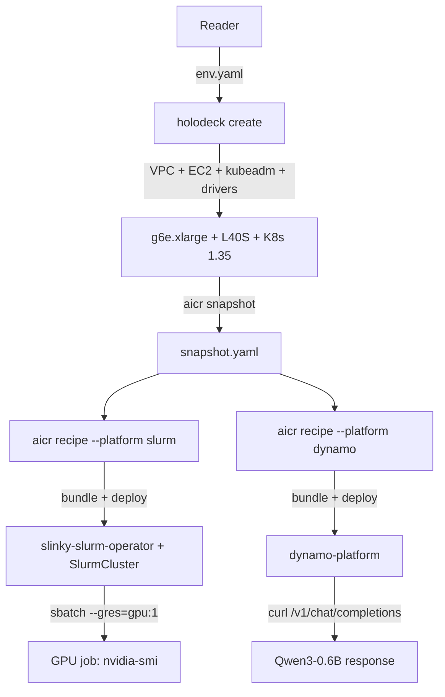

# Holodeck + AICR: From Zero to a Multi-Platform GPU Cluster

> Provision a GPU-ready Kubernetes cluster with Holodeck, then layer
> Slurm (HPC) and Dynamo (inference) on top with AICR — end-to-end in
> ~25 minutes for about $2 of AWS spend.

## What you'll build

End state: one AWS `g6e.xlarge` instance (1× NVIDIA L40S), a single-
node kubeadm cluster, the `slinky-slurm-operator` running a one-node
Slurm cluster (you can `sbatch --gres=gpu:1`), and the Dynamo platform
serving Qwen3-0.6B over an OpenAI-compatible API.



The "superpower" is composition: one declarative `Environment`, one
snapshot, two validated recipes — both an HPC batch path and an
inference path running on the same hardware.

## Prerequisites

- `holodeck` v0.3.0+ installed (`make build && sudo mv ./bin/holodeck /usr/local/bin/`)
- `aicr` v0.x installed (`brew install NVIDIA/aicr/aicr` — see
  [AICR installation](https://github.com/NVIDIA/aicr/blob/main/docs/user/installation.md))
- AWS account with credentials in your environment and `g6e` quota in
  `us-west-2` (request via the EC2 service quotas console)
- `kubectl`, `yq`, `jq`, and `curl` on your path
- ~$2 of AWS spend budget (g6e.xlarge is roughly $1.86/hr on-demand
  in `us-west-2`)

## Phase 1 — Provision with Holodeck

### 3.1 Configure

Open [`examples/aicr-demo/environment.yaml`](../../examples/aicr-demo/environment.yaml):

```yaml
apiVersion: holodeck.nvidia.com/v1alpha1
kind: Environment
metadata:
  name: aicr-demo-l40s
spec:
  provider: aws
  auth:
    keyName: <your key name here>
    privateKey: <your key path here>
  instance:
    type: g6e.xlarge          # 1x NVIDIA L40S (48 GiB VRAM), 4 vCPU, 32 GiB host RAM
    region: us-west-2
    os: ubuntu-22.04
    image: { architecture: x86_64 }
  containerRuntime:    { install: true, name: containerd }
  nvidiaContainerToolkit: { install: true }
  nvidiaDriver:        { install: true }
  kubernetes:
    install: true
    installer: kubeadm
    version: v1.35.0          # AICR requires K8s 1.34+
    crictlVersion: v1.35.0
```

What matters in this YAML:

- `provider: aws` + `auth` (`keyName`, `privateKey`) — the only fields you edit.
- `instance.type: g6e.xlarge` — cheapest cloud SKU in AICR's `l40` accelerator row.
- `os: ubuntu-22.04` — the AMI is auto-resolved by region; SSH username is auto-detected.
- `kubernetes.version: v1.35.0` — AICR's recipe floor is K8s 1.34+,
    and 1.35 is the current line.
- `containerd` + `nvidiaDriver` + `nvidiaContainerToolkit` — Day 0
    ends at host-level GPU access via a `nvidia` runtimeClass.

Copy the example into your working directory and fill in your AWS key:

```bash
cp examples/aicr-demo/environment.yaml ./my-env.yaml
$EDITOR ./my-env.yaml  # set auth.keyName and auth.privateKey
```

### 3.2 Create the cluster

```bash
holodeck create -f ./my-env.yaml
```

Holodeck creates a VPC, a security group locked to your public IP, an
EC2 instance, then runs Ansible plays (driver, container runtime,
toolkit, kubeadm). Total wall-clock is typically 6–8 minutes.

Monitor progress:

```bash
holodeck list
holodeck status <instance-id>
```

For a pre-flight check that does not touch AWS:

```bash
holodeck dryrun -f ./my-env.yaml
```

On success, holodeck writes a `./kubeconfig` to the current directory
and reports the instance as `Ready`.

### 3.3 Verify GPU + cluster

Point `kubectl` at the new cluster and confirm the node is up:

```bash
export KUBECONFIG=$PWD/kubeconfig
kubectl get nodes -o wide
```

Confirm the L40S is reachable from a pod using the `nvidia` runtimeClass:

```bash
kubectl run nvidia-smi --rm -it --restart=Never \
  --image=nvcr.io/nvidia/cuda:12.6.0-base-ubuntu22.04 \
  --overrides='{"spec":{"runtimeClassName":"nvidia"}}' \
  -- nvidia-smi
```

Expected output: the node is `Ready`, the pod prints `NVIDIA L40S`,
the driver version, and the CUDA version.

> Note: `nvidia.com/gpu` as a Kubernetes resource will NOT exist yet
> — that is the GPU Operator's job, installed by AICR in Phase 2. Day
> 0 ends at host-level GPU access via the `nvidia` runtimeClass; Day 1
> turns it into a schedulable resource.

## Phase 2 — Compose with AICR

### 2.1 Snapshot the cluster

```bash
aicr snapshot --output snapshot.yaml
yq '.metadata, .measurements[] | {(.type): [.subtypes[].subtype // .subtypes[].name]}' snapshot.yaml
```

A snapshot is AICR's read of your live cluster — node provider, GPU
model, kernel, container runtime, OS, K8s server version, installed
operators. AICR uses it two ways:

- as input to `recipe` (matches a validated configuration to your
    hardware), and
- as a baseline that `validate` compares against later.

Skim the output; you should see your L40S detected under `GPU.smi.gpu`
with the Ada Lovelace architecture, the installed driver version, and
the CUDA version. Snapshot capture takes under a minute.

### 2.2 Slurm track

The first thing AICR layers onto the cluster is a Slurm batch
scheduler via the SchedMD Slinky operator (`--platform slurm`, added
in AICR PR #866).

Generate the recipe from your snapshot:

```bash
aicr recipe --snapshot snapshot.yaml \
  --intent training --platform slurm \
  --output recipe-slurm.yaml
```

Materialize it into a deployable bundle:

```bash
aicr bundle --recipe recipe-slurm.yaml --output ./bundle-slurm
cd ./bundle-slurm && ./deploy.sh && cd ..
```

The bundle's `deploy.sh` installs (in order): cert-manager, the
slinky-slurm-operator CRDs, and the operator itself in the `slinky`
namespace.

Wait for the operator to be Ready, then bring up a single-node Slurm
cluster with the committed manifest:

```bash
kubectl wait --for=condition=available deploy/slinky-slurm-operator \
  -n slinky --timeout=180s

kubectl create namespace slurm
kubectl apply -f examples/aicr-demo/slurm-cluster.yaml

# Wait for the controller pod:
kubectl wait --for=condition=ready pod \
  -l app.kubernetes.io/component=controller \
  -n slurm --timeout=300s
```

Submit a one-shot GPU job via `sbatch` from inside the controller pod:

```bash
SLURM_CTL=$(kubectl get pod -n slurm \
  -l app.kubernetes.io/component=controller -o name | head -1)

kubectl exec -n slurm "$SLURM_CTL" -- \
  sbatch --gres=gpu:1 --wrap="nvidia-smi && hostname"

# Wait a few seconds, then check job state:
kubectl exec -n slurm "$SLURM_CTL" -- sacct
```

Expected: job state `COMPLETED`, job output contains the L40S
`nvidia-smi` banner.

### 2.3 Dynamo track

With Slurm running, the same cluster also gets an inference platform
— no re-provisioning. Generate the Dynamo recipe from the **same**
snapshot:

```bash
aicr recipe --snapshot snapshot.yaml \
  --intent inference --platform dynamo \
  --output recipe-dynamo.yaml

aicr bundle --recipe recipe-dynamo.yaml --output ./bundle-dynamo
cd ./bundle-dynamo && ./deploy.sh && cd ..
```

`deploy.sh` here installs the GPU Operator (which registers
`nvidia.com/gpu` on the node), the Dynamo platform, and its
dependencies. cert-manager is already present from the Slurm bundle —
the second `deploy.sh` should be a no-op for it.

Deploy a sample inference workload and wait for it:

```bash
kubectl apply -f https://raw.githubusercontent.com/NVIDIA/aicr/main/demos/workloads/inference/vllm-agg.yaml

kubectl wait --for=condition=ready pod --all \
  -n dynamo-workload --timeout=300s
```

Hit the chat-completions endpoint:

```bash
kubectl port-forward -n dynamo-workload svc/vllm-agg-frontend 8000:8000 &
PF_PID=$!

curl -s http://localhost:8000/v1/chat/completions \
  -H "Content-Type: application/json" \
  -d '{
    "model": "Qwen/Qwen3-0.6B",
    "messages": [{"role":"user","content":"What is Kubernetes?"}],
    "max_tokens": 64
  }' | jq .

kill $PF_PID
```

Expected: HTTP 200; `choices[0].message.content` contains a coherent
answer about Kubernetes.

### 2.4 Validate end state

<!-- Filled in Task 8 -->

## Why this matters

<!-- Filled in Task 9 -->

## Troubleshooting

<!-- Filled in Task 9 -->

## Next steps + cleanup

<!-- Filled in Task 9 -->
